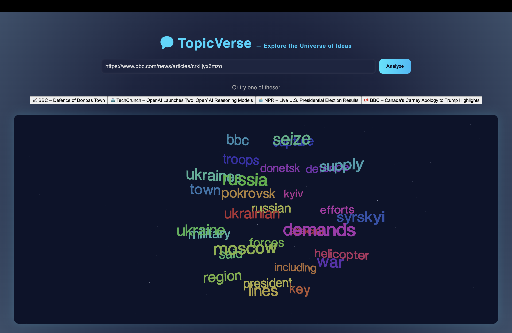

# 💬 TopicVerse — AI Topic Visualizer

An interactive **3D visualization of news article topics** powered by **FastAPI** (backend) and **React Three Fiber** (frontend). Users can input or select a pre-built article link, and instantly see key topics come alive as a glowing, rotating 3D sphere of words.

---

## 🚀 Features

- 🧠 **Intelligent Topic Extraction:** Uses TF-IDF (via scikit-learn) to identify the most relevant keywords from any article
- ⚡ **FastAPI Backend:** `/analyze` endpoint performs crawling, cleaning, and topic modeling
- 🎨 **3D Visualization:** React Three Fiber + Drei render a dynamic, interactive word sphere
- 💫 **Modern Glass UI:** Framer Motion animations + gradients for a cohesive, futuristic look
- 🌍 **Pre-Built Article Links:** Includes ready-to-use sample URLs (BBC, TechCrunch, NPR, etc.)
- 🔮 **Auto-Rotating Display:** Words scale, glow, and float based on relevance or frequency

---

## 🧩 Tech Stack

### Frontend
- React (Vite)
- Three.js + React Three Fiber + Drei
- Framer Motion (animations)
- Modern CSS (glassmorphism + gradients)

### Backend
- Python (FastAPI)
- BeautifulSoup (web scraping)
- scikit-learn (TF-IDF topic modeling)
- Uvicorn (server)

---

## ⚙️ How It Works

1. **User enters or selects a news article URL**
2. **Frontend (React)** sends the URL to **FastAPI** (`POST /analyze`)
3. **Backend**:
   - Fetches the article text using BeautifulSoup
   - Cleans and processes text with TF-IDF
   - Extracts top keywords with relevance scores
4. **Frontend**:
   - Maps keyword weights to 3D size, color, and glow intensity
   - Renders an animated, interactive word sphere in real time

---

## 🧰 Installation & Setup

### Backend Setup

```bash
cd backend
pip install -r requirements.txt
uvicorn main:app --reload
```

**Backend runs at:** http://127.0.0.1:8000

**Interactive API docs:** http://127.0.0.1:8000/docs

### Frontend Setup

```bash
cd frontend
npm install
npm run dev
```

**Frontend runs at:** http://localhost:5173

---

## 🧠 Example API Usage

### Endpoint

```
POST /analyze
```

### Request Body

```json
{
  "url": "https://www.bbc.com/news/technology-67171384"
}
```

### Response

```json
{
  "topics": [
    { "word": "ai", "weight": 0.5231 },
    { "word": "model", "weight": 0.4412 },
    { "word": "openai", "weight": 0.3378 }
  ]
}
```

---

## 🌈 Demo Article Links

| Source | Title | URL |
|--------|-------|-----|
| ⚔️ BBC | Defence of Donbas Town | [Read](https://www.bbc.com/news/world-europe) |
| 🤖 TechCrunch | OpenAI Launches Two 'Open' AI Reasoning Models | [Read](https://techcrunch.com/2024/12/20/openai-launches-two-open-ai-reasoning-models/) |
| 🗳️ NPR | Live U.S. Presidential Election Results | [Read](https://www.npr.org/elections) |
| 🇨🇦 BBC | Canada's Carney Apology to Trump Highlights | [Read](https://www.bbc.com/news/world-us-canada) |

Click any sample link in the app to visualize instantly.

---

## 📸 Preview

Add a screenshot of your running app here:

```

```

---

## 📜 License

MIT License © 2025 — Developed by Jeet Vishal Patel